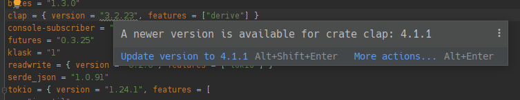
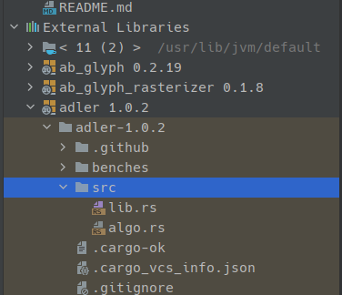

<!--
footer: "Markdown presentation on Markdown presentations"
-->

<!--
paginate: true
 -->

<!-- 
_footer: ''
_paginate: false
 -->

<!-- _class: lead -->

# MARP on MARP

Less annoying presentation slides

---

# It's just markdown

````markdown
# It's just markdown
````

### No, really

````markdown
### No, really
````

Slide separator:
````markdown
---
````

---

# Obviously numbered and bullet points 

1. numbering
1. works

* Bullet points
* work
* as
* as well

---

# Syntax highlighting in code blocks

`inline monospace` and codeblocks are styled via CSS:

```rust
#[derive(Default)]
pub enum Option<T> {
    #[default]
    None,
    Some(T),
}
```

```markdown
# **Highlighting Markdown in Markdown**

Great for talking about MARP itself via MARP
```

---

# Syntax highlighting via [highlight.js](highlightjs.org)

```python
even = [i for i in range(N) if not(i % 2)] # with comment
```
<br>

### Changing CSS per-slide with `<style scoped>`:

````html
<style scoped>
  .hljs-comment {
    color: #55ff44;
  }
</style>
````

---

# Syntax highlighting via [highlight.js](highlightjs.org)

<style scoped>
.hljs-comment {
    color: #55ff44;
}
</style>

```python
even = [i for i in range(N) if not(i % 2)] # with comment
```

<br>

### Changing CSS per-slide with `<style scoped>`:

````html
<style scoped>
  .hljs-comment {
    color: #55ff44;
  }
</style>
````

---

Links, headings, and `inline code` compose:

# [`impl<T> Clone for Option<T>`](https://doc.rust-lang.org/std/option/enum.Option.html#impl-Clone-for-Option%3CT%3E)

<style scoped>
pre {
   font-size: 1.7rem;
}
</style>

````markdown
# [`impl<T> Clone for Option<T>`]
(https://doc.rust-lang.org/std/
option/enum.Option.html#
impl-Clone-for-Option%3CT%3E)
````

---

# Images in tables

<style scoped>
table, tr, td, th {
  all: unset;
  border: 0 !important;
  background: transparent !important;
}
table { display: table; }
tr { display: table-row; }
td, th { display: table-cell; }

table {
  width: 100%;
}
td {
  vertical-align: middle;
  width: 10%;
  padding: 0 15px;
}
</style>
<table>
<td>


</td>
<td>


</td>
</tr>
</table>

---


# Images in tables

```markdown
<table>
<td>


</td>
<td>


</td>
</tr>
</table>
```

---

# Code Blocks in Tables (yes Tables)

### Yes it doesn't look great, but CSS
<style scoped>
pre {
  font-size: 0.8rem;
}
table, tr, td, th {
  all: unset;
  border: 0 !important;
  background: transparent !important;
  padding: 10px;
}
table { display: table; }
tr { display: table-row; }
td, th { display: table-cell; }

table {
  width: 100%;
}
td {
  vertical-align: middle;
}
</style>

<table>
<td>

```rust
impl const From<!> for Infallible {
    fn from(x: !) -> Self {
        x
    }
}
```
</td>
<td>

```rust
#[test]
#[should_panic(expected = "explicit panic")]
fn t() {
    #[allow(unreachable_code)]
    let _b = bool::from(panic!());
}
```
</td>
</tr>
</table>

---

# Custom Directives

Most special MARP directives are just inline HTML comments.

<style scoped>
pre {
   font-size: 1.2rem;
}
</style>

````html
<!-- _footer: "http://turbo.fish/" -->

<!-- paginate: true -->

<!-- _class: lead -->
````

Underscore (`_class`) means: "Just for this slide".

<!-- _footer: "http://turbo.fish/" -->

---

# Image syntax

<style scoped>
pre {
   font-size: 1.7rem;
}
</style>

````markdown

````

blur, saturate, invert, ... who needs those anyway...

---

# Image syntax


<!-- _footer: "[live-topology.drawio.png](https://github.com/barafael/protohackers/blob/main/speedd/live-topology.drawio.png)" -->

---

# Image syntax


<!-- _footer: "[live-topology.drawio.png](https://github.com/barafael/protohackers/blob/main/speedd/live-topology.drawio.png)" -->

---

# Images

<style scoped>
pre {
   font-size: 1.4rem;
}
</style>

````markdown
* Listener
* Collector
* Clients
  - Camera
  - Dispatcher
* Heartbeats


````

<!-- _footer: "[speedd.drawio.png](https://github.com/barafael/protohackers/blob/main/speedd/speedd.drawio.png)" -->

---

# Images

* Listener
* Collector
* Clients
  - Camera
  - Dispatcher
* Heartbeats


<!-- _footer: "[speedd.drawio.png](https://github.com/barafael/protohackers/blob/main/speedd/speedd.drawio.png)" -->

---


# Double Split

So hip.

<style scoped>
pre {
   font-size: 1.4rem;
}
</style>
````markdown


````

---

# Triple Split

<style scoped>
pre {
   font-size: 1.5rem;
}
</style>

````markdown


<!-- _footer: "" -->
````

---


<!-- _footer: "" -->

---

# Wild things with iframes

<!-- _class: "lead" -->

```markdown
<!-- _class: "lead" -->
```

---

<iframe width="100%" height="80%" src="https://play.rust-lang.org/?version=stable&mode=debug&edition=2021&code=use+std%3A%3Aptr%3A%3A%7Baddr_of%2C+addr_of_mut%7D%3B%0A%0Aconst+N%3A+usize+%3D+3%3B%0Aconst+DATA%3A+%5Bu8%3B+12%5D+%3D+%5B1%2C+2%2C+3%2C+4%2C+5%2C+6%2C+7%2C+8%2C+9%2C+10%2C+1%2C+212%5D%3B%0A%0Afn+main2%28%29+%7B%0A++++let+mut+packet%3A+u32+%3D+0%3B%0A++++let+ptr+%3D+addr_of_mut%21%28packet%29.cast%3A%3A%3Cu8%3E%28%29%3B%0A++++for+%28i%2C+item%29+in+DATA.iter%28%29.enumerate%28%29.take%28N%29+%7B%0A++++++++unsafe+%7B+*ptr.add%28i%29+%3D+*item+%7D%3B%0A++++%7D%0A++++println%21%28%22%7Bpacket%3Ab%7D%22%29%3B%0A%7D%0A%0Afn+main%28%29+%7B%0A++++let+packet%3A+u32+%3D+0%3B%0A++++let+ptr+%3D+%26packet+as+*const+u32+as+*mut+u8%3B%0A++++for+i+in+0..N+%7B%0A++++++++unsafe+%7B+*ptr.offset%28i+as+isize%29+%3D+DATA%5Bi%5D+%7D%3B%0A++++%7D%0A++++println%21%28%22%7Bpacket%3Ab%7D%22%29%3B%0A%7D%0A">
</iframe>

---

<iframe width="100%" height="90%" src="https://www.egui.rs/#demo">
</iframe>
